# MySQL数据库配置
## 一、 阿里云配置服务器端口 【3306】：
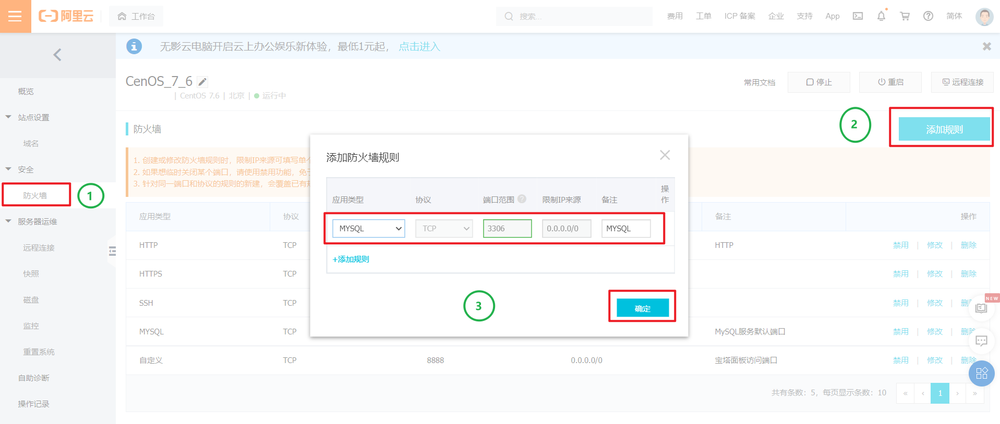
## 二、 宝塔面板配置  
### 1. 打开宝塔面板端口 【3306】：
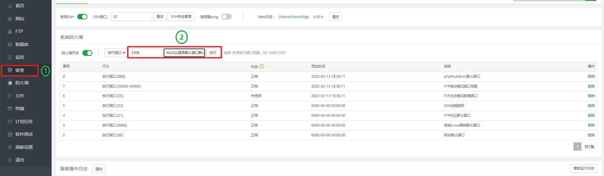
###  2. 修改mysql的配置文件：
在 [mysqld] ，添加语句： skip-grant-tables
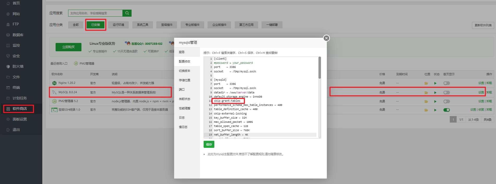
###  3. 重启MySQL服务器：
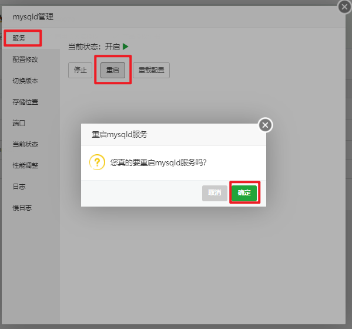
###  4. 设置MySQL密码：
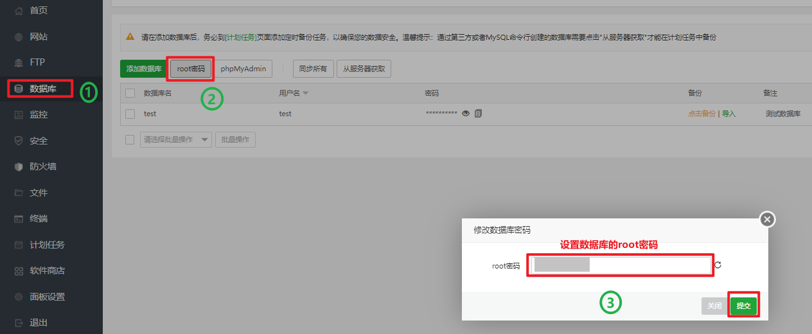
## 三、Navicat导入数据库：
### 1. 建立数据库连接：
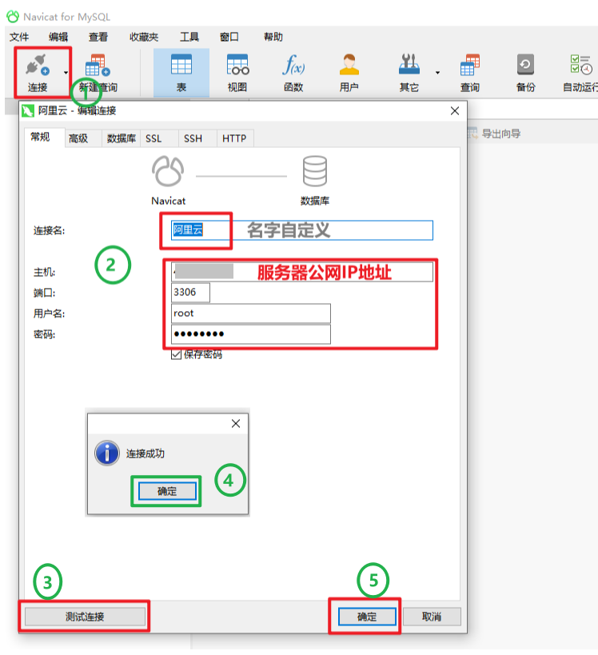
### 2. 新建数据库：
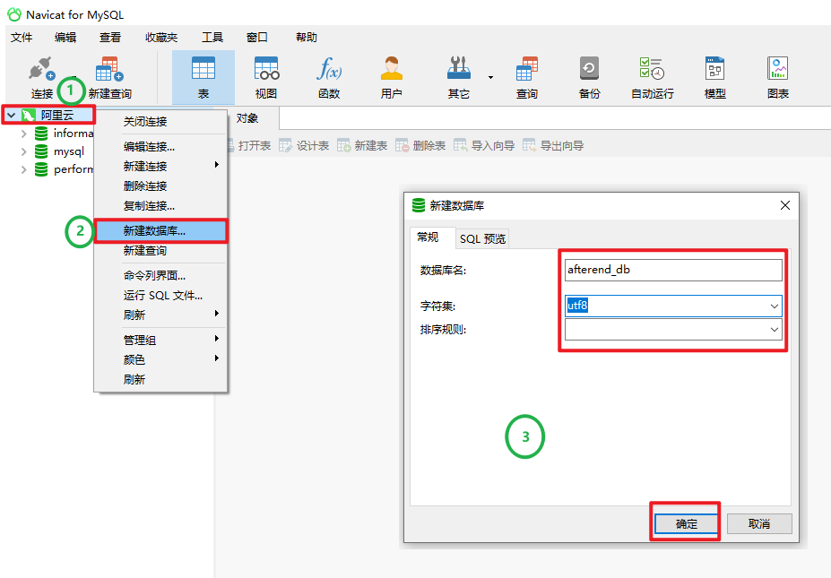
### 3. 导入SQL数据库结构和数据：
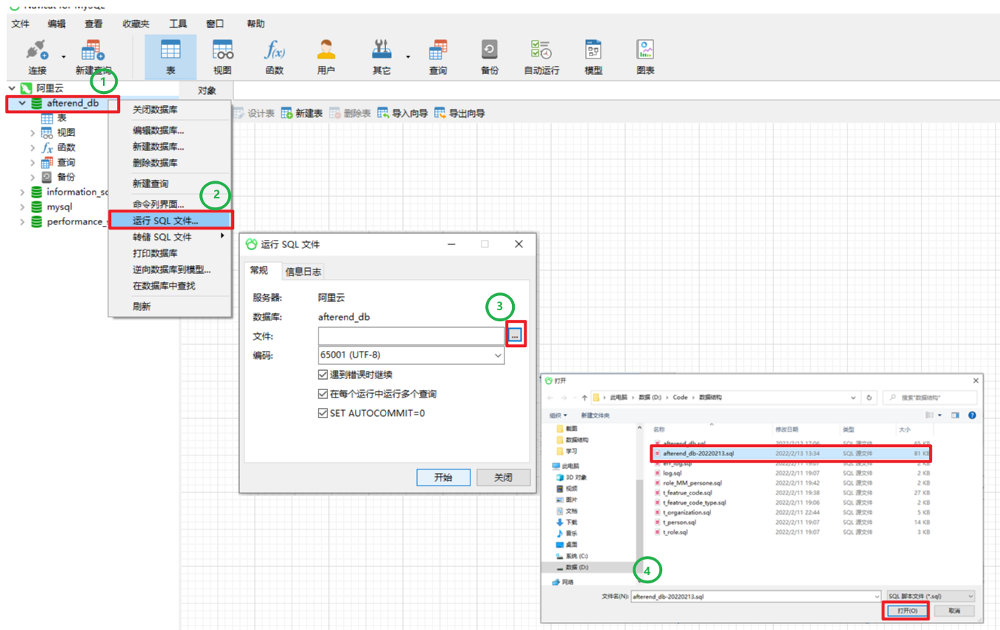
 导入中...耐心等待 
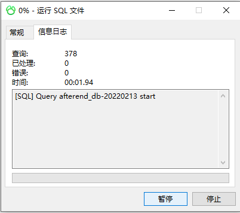
### 4. 完成导入：
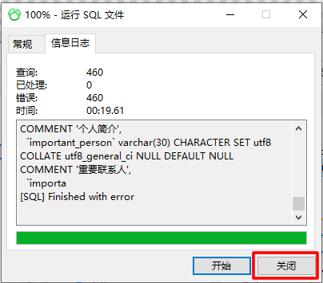
 查看表: 
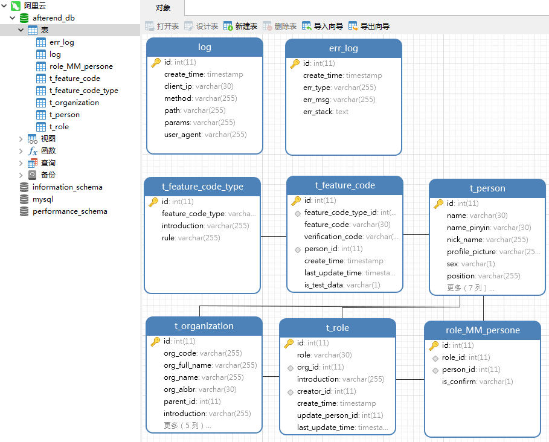
