# 代码部署
## 一、 上传本地代码到服务器
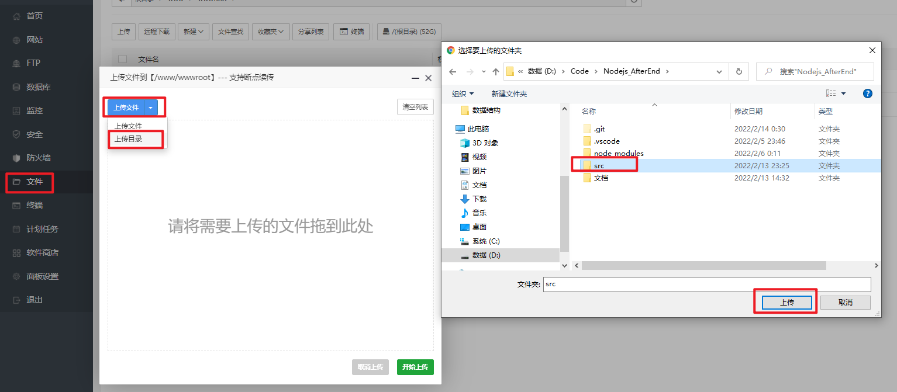
上传文件：LICENSE、 package.json、yanr.lock;  
上传文件夹：【src】  
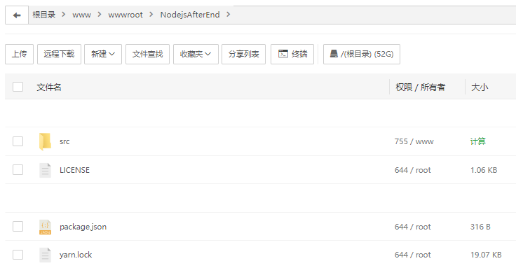
### 特别提示：不要上传本地文件夹【node_modules】
## 二、 安装依赖
1. 进入终端
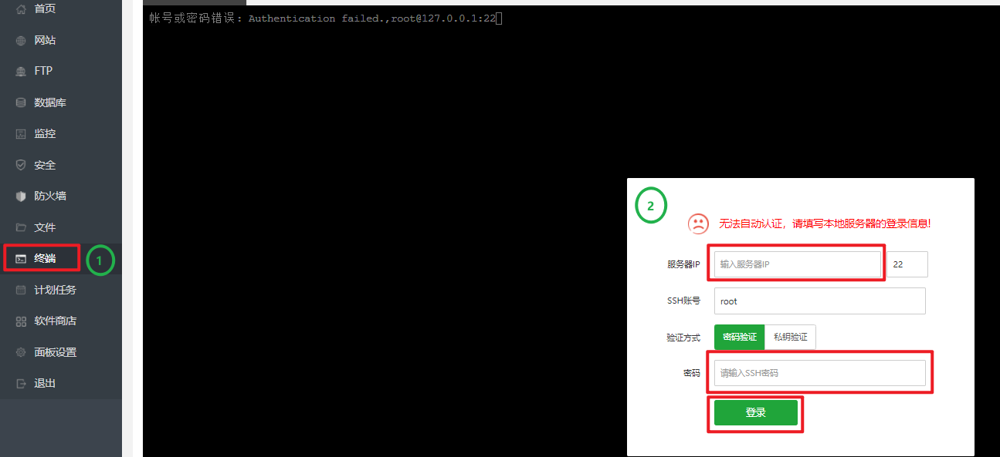
2. 在项目根目录下运行yarn，系统自动安装依赖  
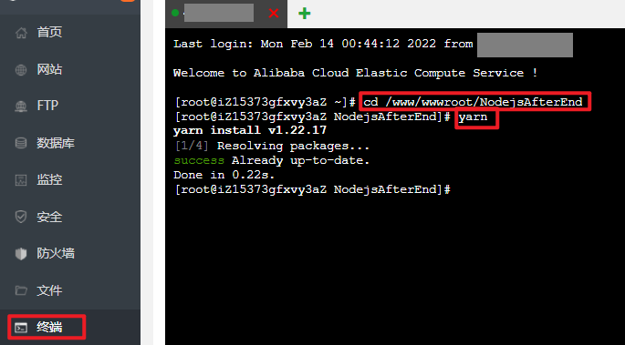
### 特别注意：如果Node服务安装后，发生500错误，建议删除package.json中向上的尖括号： ^   
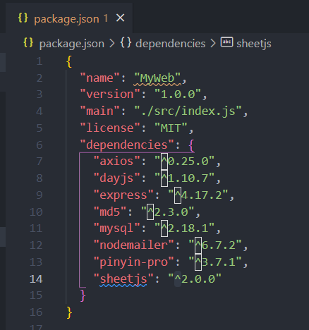
 原因：服务器在安装依赖时，版本过高；package.json中: ~ 和 ^ 的含义: 
1）' ~ ' ：指定版本：比如  "core-js": "~3.6.5", 表示安装【3.6.x】的最新版本（不低于3.6.5），但是不安装3.7.x，也就是说安装时不改变大版本号和次要版本号; 
2）' ^ '：指定版本：比如 "antd": "^3.1.4",表示安装【3.X】的最新版本(不低于3.1.4），但是不安装4.0.0，也就是说安装时不改变大版本号。

## 三、 配置网站
1. 添加网站
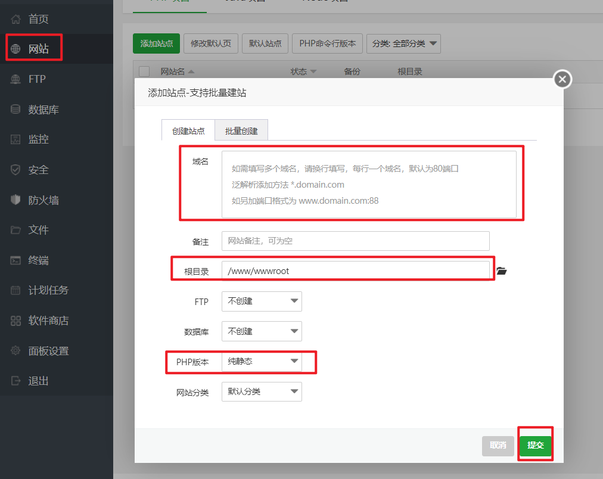
2. 添加Node.js监听的端口
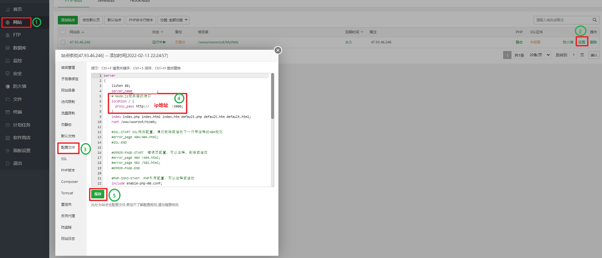
 这个端口要与，node.js的入口文件【src/index.js】中的端口一致: 
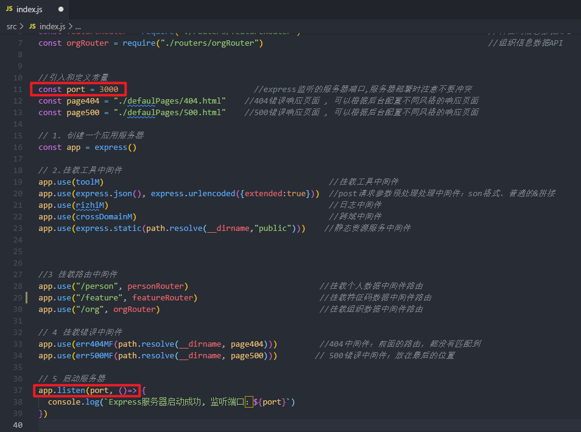
3. 放行Node.js监听的端口
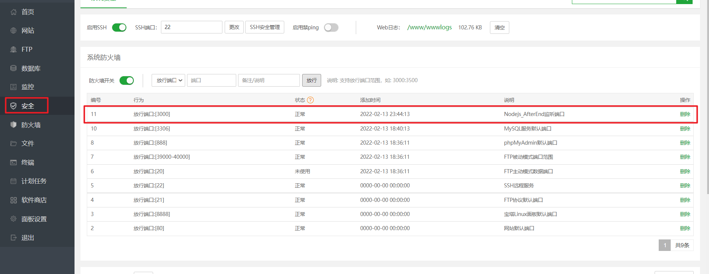
4. 配置pm2
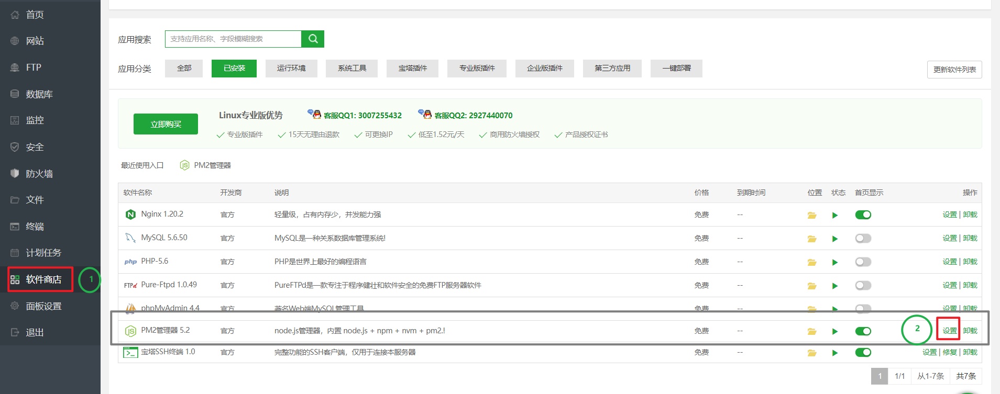
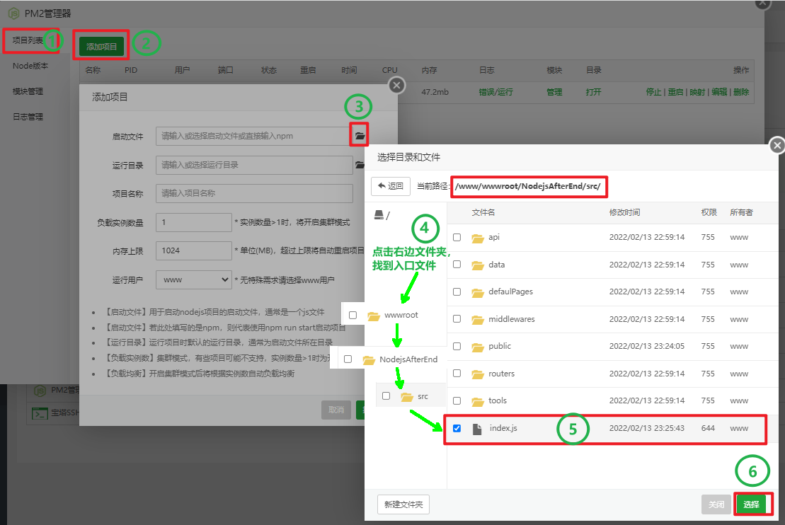
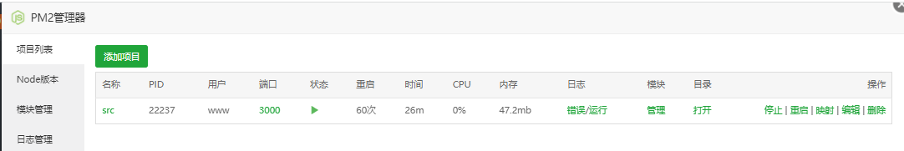

## 四、 测试网站
1. 运行接口测试 
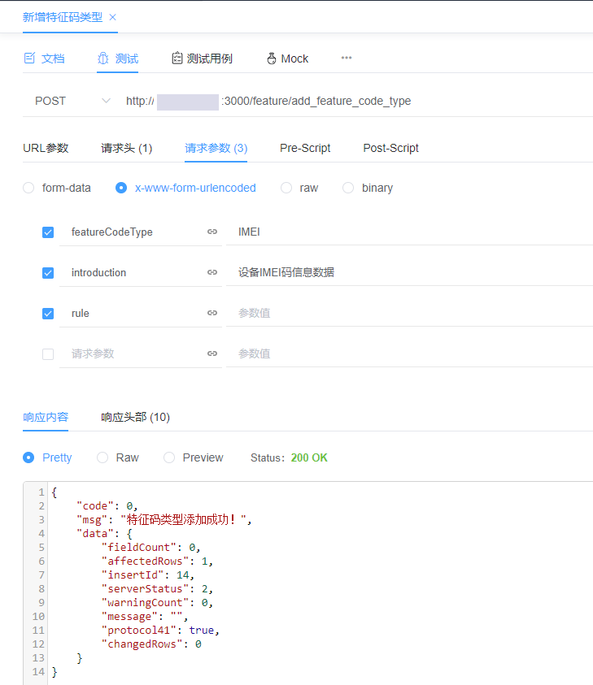
2. 查看数据库  
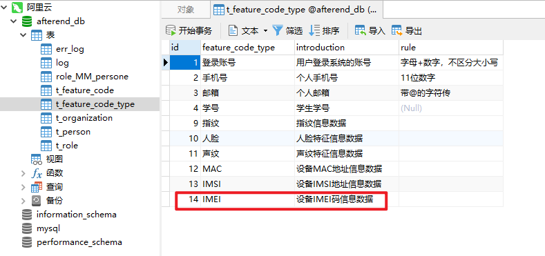
