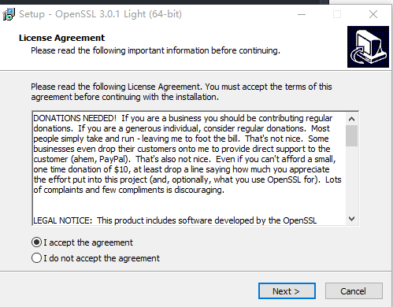
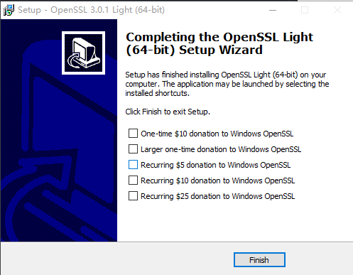
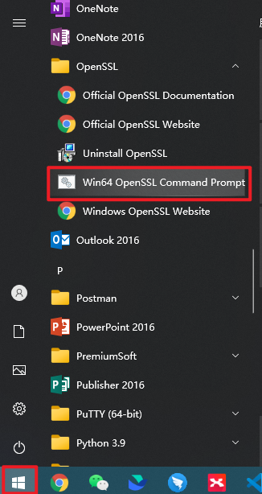
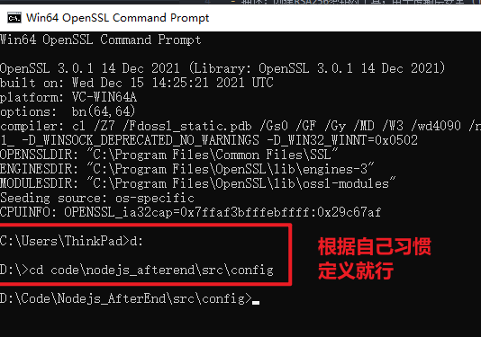
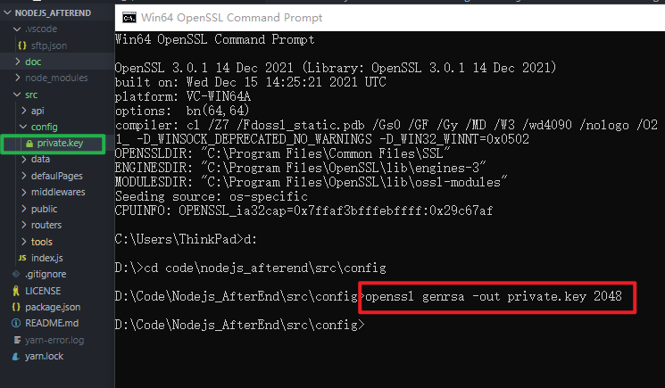
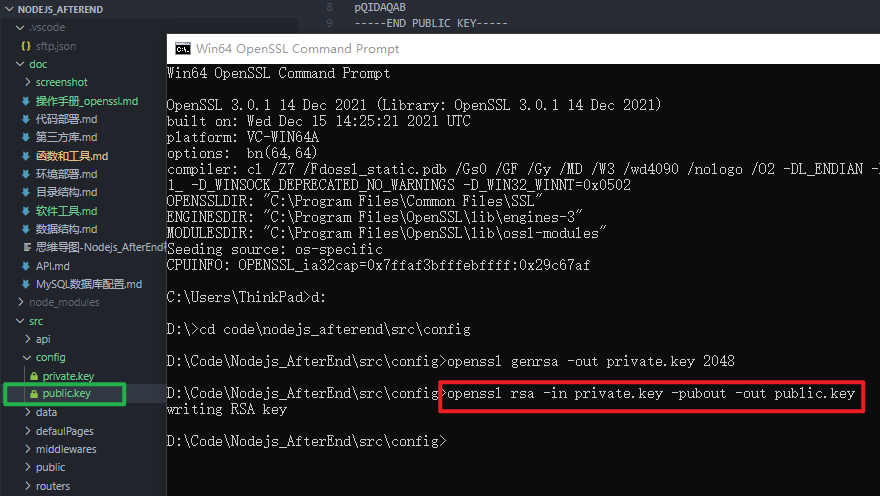

# 操作手册_openssl
- [参考文档](https://www.openssl.org/)
- 描述：创建RSA256密钥对工具；用于传输层安全 (TLS) 协议的的开源工具，实现基于全强度通用密码库；
- 使用方法：
   1. 安装
      1. 下载安装包：[下载](http://slproweb.com/download/Win64OpenSSL_Light-3_0_1.exe)
      2. 本地安装
      
      下一步 -> 下一步 ...
      
      3. 从电脑的开始菜单,打开本地openssl终端窗口
      
      4. 进入本地项目文件夹存放的文件夹
      
      5. 生成一个 2048 位的私钥 private.key 文件 
      备注：private.key 密钥文件中包含了私钥和公钥
      openssl genrsa -out private.key 2048
      
      6. 从private.key中提取公钥 public.key文件
      openssl rsa -in private.key -pubout -out public.key
      