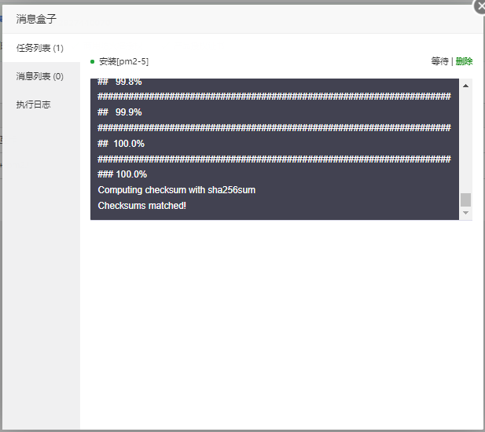

# 环境部署
##  1. 阿里云服务器设置：
  1) 设置【客户端访问密码】：  

  2) 打开服务器端口 8888 （宝塔面板需要使用的端口）  

## 2. 安装宝塔面板 
### 1. 在线一键快速安装宝塔，浏览器访问：https://www.bt.cn/download/linux.html       
  1) 下拉浏览器页面，找到以下界面：输入服务器(公网)IP; 阿里云服务器,【客户端访问密码】 

  2) 选择需要安装的软件  

 安装中... 耐心等待 

  3) 安装成功，复制、保存面板信息  

  在浏览器输入上面保存的：【面板地址】、【用户名】、【密码】，登录宝塔面板  

### 2. 安装软件
  1) 安装Nodejs进程管理软件:pm2  

 安装中...耐心等待 

  2) 安装资源管理器：:yarn  

 yarn安装成功 

